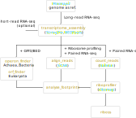

## Comparing the translatability of open reading frames within individual transcripts

RIBOSS consists of Python modules for analysing ribosome profiling data from prokaryotes and eukaryotes. See `styphimurium.ipynb` for an example, where RIBOSS combines ribosome profiling with long/short-read sequencing technologies.

[

### Install dependencies

#### install Anaconda

```
wget https://repo.anaconda.com/archive/Anaconda3-2024.06-1-Linux-x86_64.sh -O ~/Anaconda3.sh
bash ~/Anaconda3.sh -b -p $HOME/Anaconda3
```

#### Create a conda environment and install packages

```
conda create -n riboss -y
conda activate riboss
pip install tables cython pysam quicksect cgatcore pandarallel rseqc # rseqc is optional
conda install -c bioconda -c conda-forge biopython pysam htslib bedtools minimap2 star fastp tqdm # fastp is optional
git clone https://github.com/cgat-developers/cgat-apps.git
cd cgat-apps
python setup.py develop
```

#### Install samtools

```
wget https://github.com/samtools/samtools/releases/download/1.21/samtools-1.21.tar.bz2
tar jxvf samtools-1.21.tar.bz2
cd samtools-1.21
autoheader
autoconf -Wno-syntax
make
pwd | awk '{print "export PATH=\"" $1 ":$PATH\""}' >> ~/.bashrc
```

#### Download precompiled tools

```
git clone https://github.com/lcscs12345/riboss.git
DIRNAME=`which python | xargs dirname`
cp riboss/bin/riboprof $DIRNAME
chmod +x $DIRNAME/riboprof

wget https://hgdownload.cse.ucsc.edu/admin/exe/linux.x86_64/gtfToGenePred
wget https://hgdownload.cse.ucsc.edu/admin/exe/linux.x86_64/genePredToBed
wget https://hgdownload.cse.ucsc.edu/admin/exe/linux.x86_64/bedSort
mv gtfToGenePred genePredToBed bedSort $DIRNAME
# chmod +x $DIRNAME/gtfToGenePred
# chmod +x $DIRNAME/genePredToBed

wget https://github.com/gpertea/stringtie/releases/download/v2.2.3/stringtie-2.2.3.Linux_x86_64.tar.gz
tar zxvf stringtie-2.2.3.Linux_x86_64.tar.gz
mv stringtie-2.2.3.Linux_x86_64/stringtie $DIRNAME
# chmod +x $DIRNAME/stringtie

cd DIRNAME
wget https://github.com/COMBINE-lab/salmon/releases/download/v1.10.0/salmon-1.10.0_linux_x86_64.tar.gz
tar zxvf salmon-1.10.0_linux_x86_64.tar.gz
pwd | awk '{print "export PATH=\"" $1 "/salmon-latest_linux_x86_64/bin:$PATH\""}' >> ~/.bashrc
```

#### Finally

```
source ~/.bashrc
```

#### Related article:

- Lim, C.S., Wardell, S.J.T., Kleffmann, T. & Brown, C.M. (2018) The exon-intron gene structure upstream of the initiation codon predicts translation efficiency. Nucleic Acids Res. 46: 4575-4591.
- Bryant, O.J., Lastovka, F., Powell, J. et al. (2023) The distinct translational landscapes of gram-negative Salmonella and gram-positive Listeria. Nat Commun 14, 8167.
- Ondari, E.M., Klemm, E.J., Msefula, C.L. et al. (2019) Rapid transcriptional responses to serum exposure are associated with sensitivity and resistance to antibody-mediated complement killing in invasive Salmonella Typhimurium ST313 [version 1; peer review: 2 approved]. Wellcome Open Res, 4:74
