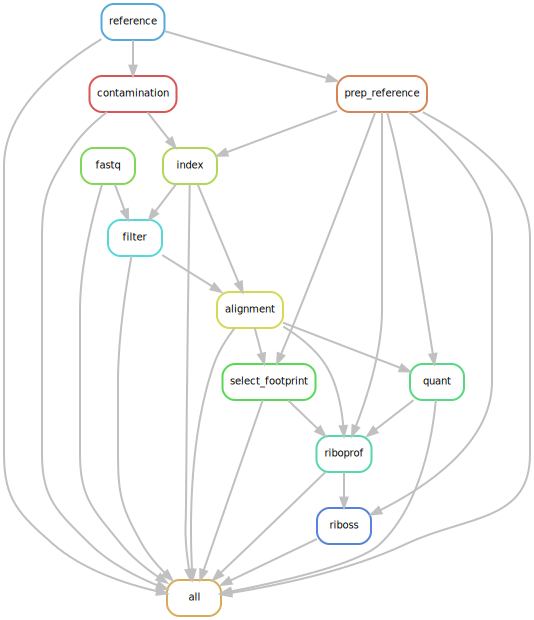

### A pipeline for comparing the strength of open reading frames (ORFs) within individual transcripts.

Dependencies:
- snakemake=5.24.0
- STAR=2.7.5c (https://github.com/alexdobin/STAR)
- salmon=1.3.0 (https://github.com/COMBINE-lab/salmon)
- riboprof=1.2 (https://github.com/Kingsford-Group/ribomap)
- Biopython=1.77
- pysam=0.15.3
- pandas=1.1.1
- scipy=1.5.2
- matplotlib=3.3.1
- seaborn=0.10.1

```riboprof``` is available as a precompiled executable. Other dependencies can be installed through ```conda``` or ```pip```.

The python scripts can be executed independently. 
- ```prep_reference_files.py``` prepares the reference transcriptome files for ```STAR```, ```salmon```, ```riboprof```, and ```riboss.py```.
- ```select_footprint_size.py``` selects the best ribosome footprint sizes by triplet periodicity using Fisher's exact test.
- ```riboss.py``` compares the strength of upstream and downstream ORFs with main ORFs using Fisher's exact test.

Snakemake is only required to run the example pipeline as follows:
```
snakemake -j1 -s riboss.smk
```


if you find this useful, please consider citing:
- Lim, C.S. & Brown, C.M. Synergistic effects of upstream open reading frames and leader exon-exon junctions on protein expression. (In preparation).
- Lim, C.S., Wardell, S.J.T., Kleffmann, T. & Brown, C.M. (2018) The exon-intron gene structure upstream of the initiation codon predicts translation efficiency. Nucleic Acids Res. 46: 4575-4591.
