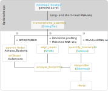

[](https://opensource.org/licenses/MIT)
[](https://www.python.org)

## Comparing the translational potential of open reading frames within individual transcripts

Ribosome profiling is routinely used for discovering actively translated ORFs. Standard ribosome profiling involves RNase digestion of ribosome-protected mRNA fragments, followed by sucrose gradient fractionation, and RNA sequencing (RNA-seq).

As ribosomes progress along the mRNA codon-by-codon, they generate a characteristic triplet periodicity profile in the footprint data. Triplet periodicity can be used to determine the correct reading frame for the translated ORFs and distinguish true translation events from background noise.

RIBOSS is a Python package that integrates long- and short-read RNA sequencing data for reference-guided transcriptome assembly with ribosome profiling data to identify and characterise novel translational events beyond annotated regions. See the use cases and benchmarking results [here](https://github.com/lcscs12345/riboss_paper).

**Key Features:**

* **Long-Read Integration:** RIBOSS integrates long-read RNA sequencing data to improve transcriptome assembly and enhance the identification of novel translational events.
* **Assessment of Translational Potential:** RIBOSS quantitatively assesses the relative translational potential of non-canonical ORFs compared to annotated ORFs, enabling users to infer their regulatory roles.
* **Peptide Identification:** Users can optionally enable BLASTP searches and efetch to identify peptides encoded by non-canonical ORFs.
* **Prokaryotic and Eukaryotic Support:** RIBOSS is designed to handle ribosome profiling data from both prokaryotic and eukaryotic species.
* **Standard Output Files:** RIBOSS generates output files in standard formats (BED12, genePred, bigGenePred, and bedGraph) compatible with widely used tools like BEDTools, UCSC Genome Browser, IGV, and Artemis.




### User guide

#### Install Miniforge3 on Linux
RIBOSS currently only supports Linux systems.
```
wget https://github.com/conda-forge/miniforge/releases/download/24.7.1-2/Miniforge3-24.7.1-2-Linux-x86_64.sh
bash Miniforge3-24.7.1-2-Linux-x86_64.sh -b -p $HOME/miniforge3
eval "$(/$HOME/miniforge3/bin/conda shell.bash hook)" # your terminal prompt will show (base) bash-5.1$
```

<!-- conda create -n riboss -y
conda activate riboss
conda install -y \
    -c conda-forge -c bioconda \
    boost-cpp seqan-library=1.4.2 \
    jupyter pandas \
    pysam seaborn matplotlib \
    stringtie=2.2.3 salmon \
    biopython htslib samtools bedtools pyranges minimap2 star tqdm jupyter \
    ucsc-gtftogenepred ucsc-bedtogenepred ucsc-genepredtobed ucsc-bedsort ucsc-bedtobigbed \
    pyfaidx rseqc
conda activate riboss
conda install bioconda::bowtie2 -y
conda env export > environment.yml -->

#### Create a conda environment and install RIBOSS

```
git clone https://github.com/lcscs12345/riboss.git
cd riboss
conda config --set channel_priority flexible # required if channel_priority was set to strict. See https://docs.conda.io/projects/conda/en/latest/user-guide/tasks/manage-channels.html
conda env create -f environment.yml

conda activate riboss # your terminal prompt will show (riboss) bash-5.1$
DIRNAME=`which python | xargs dirname`
cp bin/riboprof $DIRNAME
chmod +x $DIRNAME/riboprof
which python | awk 'sub(/python/,"pip3") {print $1, "install -e ."}' | sh # editable mode
```

<!-- pip install git+git://github.com/lcscs12345/riboss.git#egg=riboss -->

#### Activate the conda environment for next time

```
eval "$(/$HOME/miniforge3/bin/conda shell.bash hook)"
conda activate riboss
```

#### Basic usage

```
from riboss.orfs import translate
na='ATGGTCTGA'
translate(na)
```

You should see `'MV'`.

### References:
- Ingolia, N. T., Hussmann, J. A., & Weissman, J. S. (2019) Ribosome Profiling: Global Views of Translation. Cold Spring Harb. Perspect. Biol., 11. DOI: [10.1101/cshperspect.a032698](https://doi.org/10.1101/cshperspect.a032698)
- Ingolia, N. T., Ghaemmaghami, S., Newman, J. R. S., & Weissman, J. S. (2009) Genome-wide analysis in vivo of translation with nucleotide resolution using ribosome profiling. Science, 324: 218–223. DOI: [10.1126/science.1168978](https://doi.org/10.1126/science.1168978)

### Citing us:
- Lim, C. S., & Brown, C. M. (2024). RIBOSS detects novel translational events by combining long- and short-read transcriptome and translatome profiling. _Brief Bioinform_. DOI: [10.1093/bib/bbaf164](https://doi.org/10.1093/bib/bbaf164)
- Lim, C.S., Wardell, S.J.T., Kleffmann, T. & Brown, C.M. (2018) The exon-intron gene structure upstream of the initiation codon predicts translation efficiency. _Nucleic Acids Res_, 46:4575-4591. DOI: [10.1093/nar/gky282](https://doi.org/10.1093/nar/gky282)
